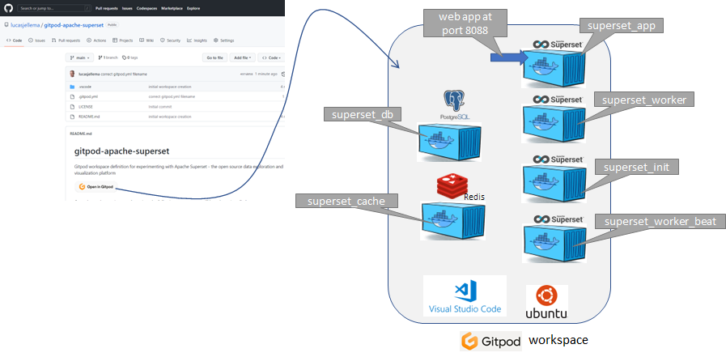
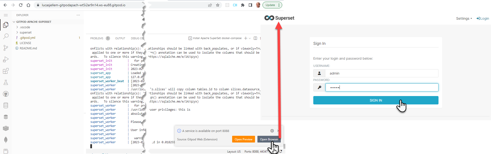
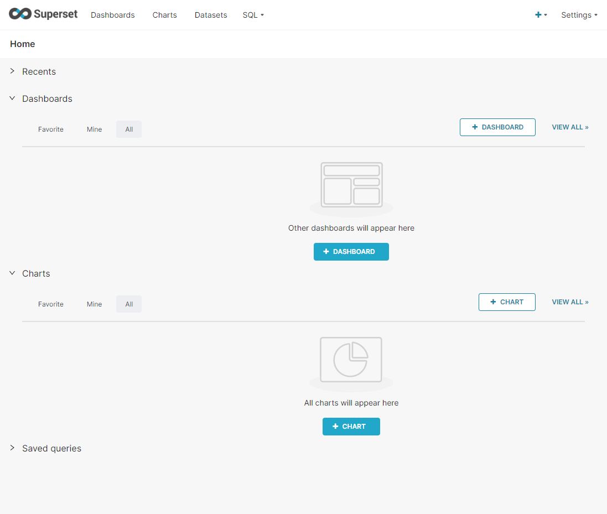
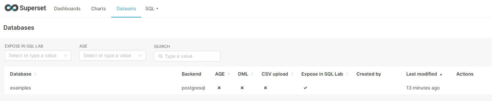
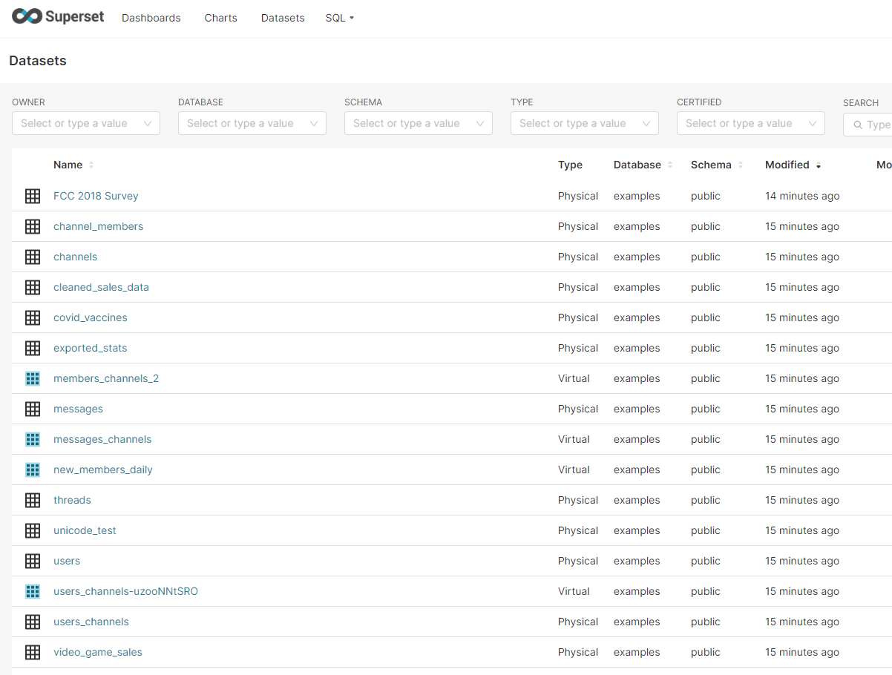
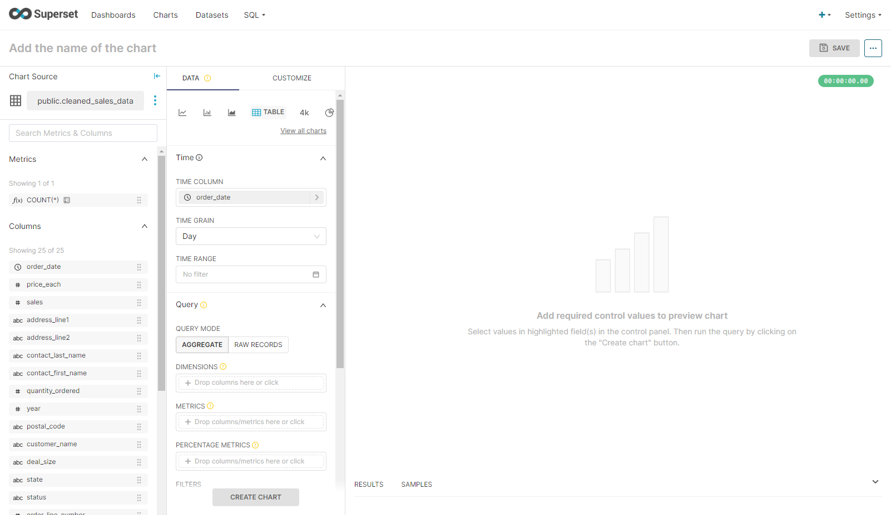
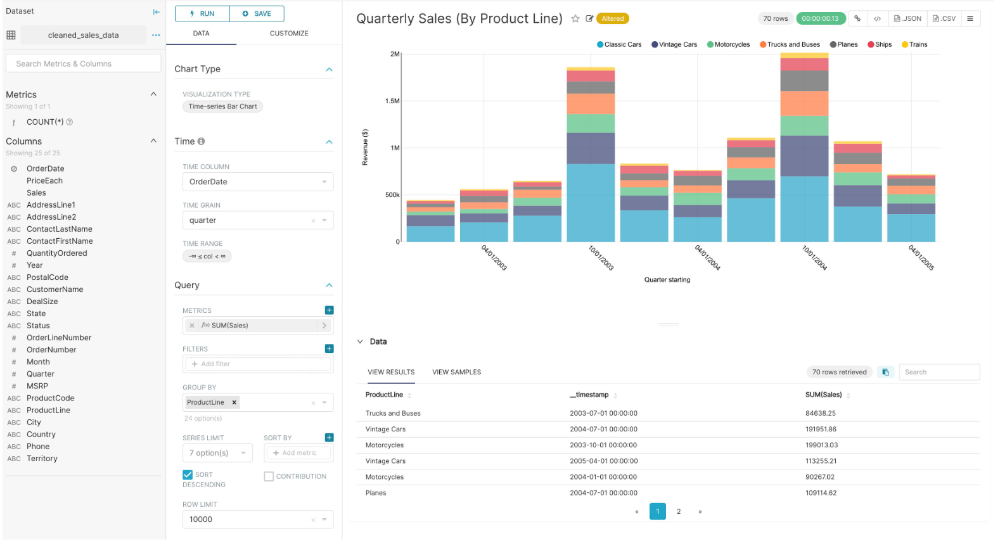

# Gitpod workspace for Apache Superset (samples included)

Gitpod workspace definition for experimenting with Apache Superset - the open source data exploration and visualization platform

Once the workspace is up and running, the following components will have been installed:
* Apache Superset
* PostgreSQL 
* Redis

all running in a Docker Container. This picture shows the contents of the workspace:
  

To get going, you can read through [this article](https://technology.amis.nl/data-analytics/getting-started-working-with-apache-superset-the-open-source-data-exploration-and-visualization-platform/) that introduces Apache Superset and the workspace. Some quick instructions:

Open port 8088 to enter the Superset web UI. Login with user admin and password admin.

  

You will enter the main page where you can start adding database connections, datasets, charts:

  
A Postgres database, named examples, is included and pre-configured in Superset for you. 
  

Quite a few data sets – derived from this examples database – are predefined in the workspace environment:

  

To quickly create a Visualization for one of these datasets, start the Explore workflow from the Datasets tab, start by clicking the name of the dataset that will be powering your chart: cleaned_sales_data: 

This is the no code, drag & drop visualization editor that you will see: 

  

By clicking, dragging and dropping the data set fields the following stacked bar chart visualization is quickly composed:

  

Click on the link View all charts to select the desired chart type:

